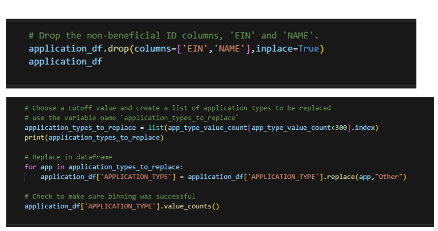
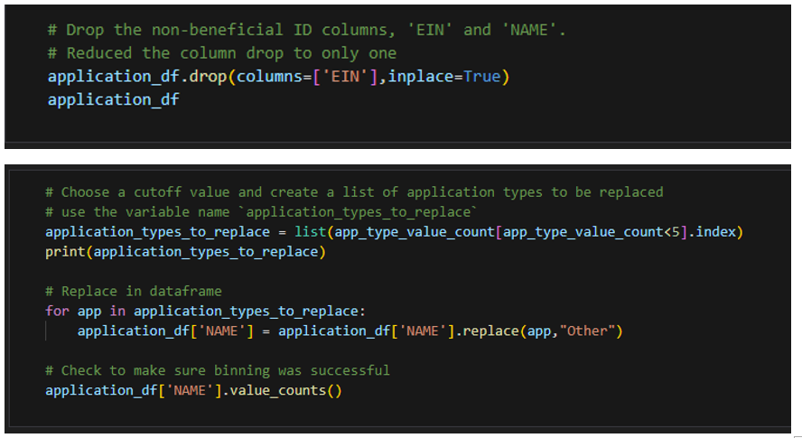

# Alphabet Soup Report using Machine learning and Neural Network

## Overview of the Analysis
--
* The nonprofit foundation Alphabet Soup wants a tool that can help it select the applicants for funding with the best chance of success in their ventures. The objective of this analysis is to use machine learning and neural network for the provided dataset, creating a binary classifier that can predict if the applicants will be successful if funded by Alphabet Soup.

## Steps followed to perform the Analysis
--
* Below is the list of activities performed which would showcase the usage of machine learning and neural network
  * Data Preprocessing Step: Preprocessing the data using pandas and scikit-learn's StarndardScaler()
  * Compile, Train, and Evaluate Step: As next step, compile, train and evaluate the neural network model. 

## Results
--

### --**Data Preprocessing Step**--  
* Within this dataset are several columns that capture metadata about each organization. These columns are used as features and target variables for this analysis.  
 

* How each of these are used with this analysis are listed below they are used for this analysis are as follows  

  * EIN - Identification column --**Removed**--
  * NAME - Identification column --**Initially Removed but later model retained which improved the accuracy**--
  * APPLICATION_TYPE—Alphabet Soup application type --**Feature Variable**--
  * AFFILIATION—Affiliated sector of industry --**Feature Variable**--
  * CLASSIFICATION—Government organization classification --**Feature Variable**--
  * USE_CASE—Use case for funding --**Feature Variable**--
  * ORGANIZATION—Organization type --**Feature Variable**--
  * STATUS—Active status --**Feature Variable**--
  * INCOME_AMT—Income classification --**Feature Variable**--
  * SPECIAL_CONSIDERATIONS—Special considerations for application --**Feature Variable**--
  * ASK_AMT—Funding amount requested --**Feature Variable**--
  * IS_SUCCESSFUL—Was the money used effectively --**TARGET Variable**--

### --**Compile, Train, and Evaluate Step**--  
* --**The first model has 3 layers (Starter_Code.ipynb JUYPTER SOURCE FILE)**-- 
  * First hidden layer has two times of the features as neurons and uses `relu` as activation function.
  * Second hidden layer has half the times of the feature count as neurons and uses `relu` as activation function.
  * final output layer has 1 unit of neuron and has `sigmoid` as activation function.
   --**Using APPLICATION_TYPE for binning**-- higher value for other category like <500 or <1000 
   

* --**The Second model has 3 layers (AlphabetSoupCharity_Optimization_dropping_MoreColumns_worst.ipynb JUYPTER SOURCE FILE)**-- 
  * First hidden layer has two times of the features as neurons and uses `relu` as activation function.
  * Second hidden layer has half the times of the feature count as neurons and uses `relu` as activation function.
  * Final output layer has 1 unit of neuron and has `sigmoid` as activation function.  
    --**Dropped More Additional Columns**-- This is performed worst as the accuracy got reduced. Not preferred method 
    --**Using APPLICATION_TYPE for binning**-- higher value for other category like <500 or <1000 

* --**The Third model has 3 layers (AlphabetSoupCharity_Optimization_dropping_FewerColumns_didn'twork.ipynb JUYPTER SOURCE FILE)**-- 
  * First hidden layer has two times of the features as neurons and uses `relu` as activation function.
  * Second hidden layer has half the times of the feature count as neurons and uses `relu` as activation function.
  * Final output layer has 1 unit of neuron and has `sigmoid` as activation function.  
    --**Dropped only EIN Column**-- This model didn't get executed and always crashed. 
    --**Using APPLICATION_TYPE for binning**-- higher value for other category like <500 or <1000 

* --**The fourth model has 4 layers (AlphabetSoupCharity_Optimization_Second_Best.ipynb JUYPTER SOURCE FILE)**-- 
  * First hidden layer has two times of the features as neurons and uses `relu` as activation function.
  * Second hidden layer has half the times of the feature count as neurons and uses `relu` as activation function.
  * Additional added hidden layer has half the times of the feature count as neurons and uses `relu` as activation function.
  * Final output layer has 1 unit of neuron and has `sigmoid` as activation function.  
    --**Dropped only EIN Column**-- and --**Using NAME instead of APPLICATION_TYPE for binning**-- lower value for other category like <5 or <10
    --**<b>Accuracy reached 78% <b>**-- 

* --**The final best model has 4 layers (AlphabetSoupCharity_Optimization_Second_Best.ipynb JUYPTER SOURCE FILE)**-- 
  * First hidden layer has two times of the features as neurons and uses `relu` as activation function.
  * Second hidden layer has half the times of the feature count as neurons and uses `relu` as activation function.
  * Additional added hidden layer has half the times of the feature count as neurons and uses `relu` as activation function.
  * Final output layer has 1 unit of neuron and has `sigmoid` as activation function.  
    --**Dropped only EIN Column**-- and --**Using NAME instead of APPLICATION_TYPE for binning**-- lower value for other category like <1 or <5
    --**<b>Accuracy reached 79% <b>**-- 
  

## Summary
-- 
Using the Machine learning and Neural network, optimized tensor flow model reached accuracy of 79%.  
 
Based on the optimization approach it is recommended  

  * To have identification column  
  * Use the identification column for binning with 
  * Minimizing the records for generic 'other' category in binning
  * Having minimal for 4 layers
 